# - AWS Infrastructure with Terraform - 

#### This README file will document how I have been able to create an AWS Infrastructure using Terraform, it will include insights, code snippets and screenshots of the work I have completed.

## - Setting up - 
#### To set up my project I have installed the following:
- Terraform
- AWS CLI

#### I will now configure my AWS credentials so that I can connect my Terraform code to AWS, to do this I ran the following command in my terminal 
```
aws configure
```
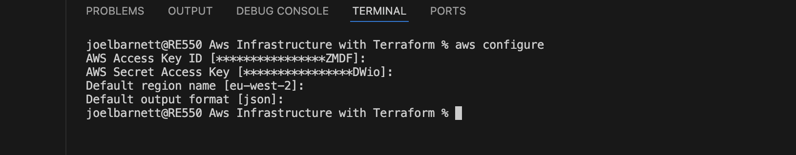 

#### As can be seen from the above, I already have my credentials configured, when I go to the IAM section on AWS I have a user set up as "terraform", I know these credentials are matched up to this IAM user as the access ID can be correlated, I have also have my default region set as "eu-west-2" this is the London region of AWS.

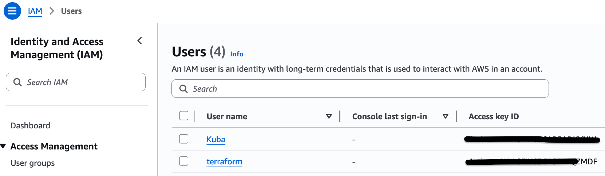 

#### I will now check with version of Terraform I have installed with the following command
```
terraform version
```
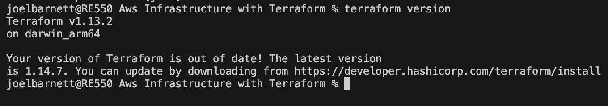

#### As can be seen my Terraform is currently running on version: v1.13.2 I was also informed this was outdated, so I installed the newest version using home brew, this then gave me v.1.14.7

## - Creating the Project Folder - 
#### Now that I have completed the set up, I need to create my project folder, I have titled this "AWS Infrastructure with Terraform", I have also laid out my Terraform into multiple .tf files to follow best practice

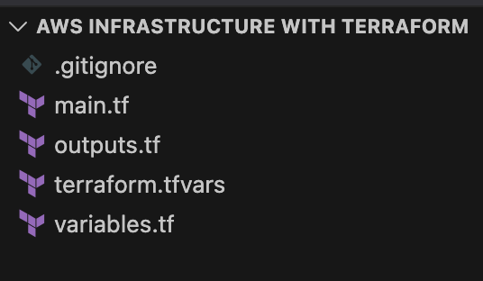 

#### The reason the Terraform infrastructure is broken down into multiple files as mainly for organisation, readability and maintainability. This helps people understand different aspects of the Terraform project when they are viewing it.

## - Creating the provider block - 
#### in the main.tf file I will set out the required versions of Terraform and AWS that I will be required, this is important to do as it makes sure that everyone running the infrastructure uses compatible versions of Terraform and its providers. This prevents unexpected failures, breaking changes, and inconsistent deployments.

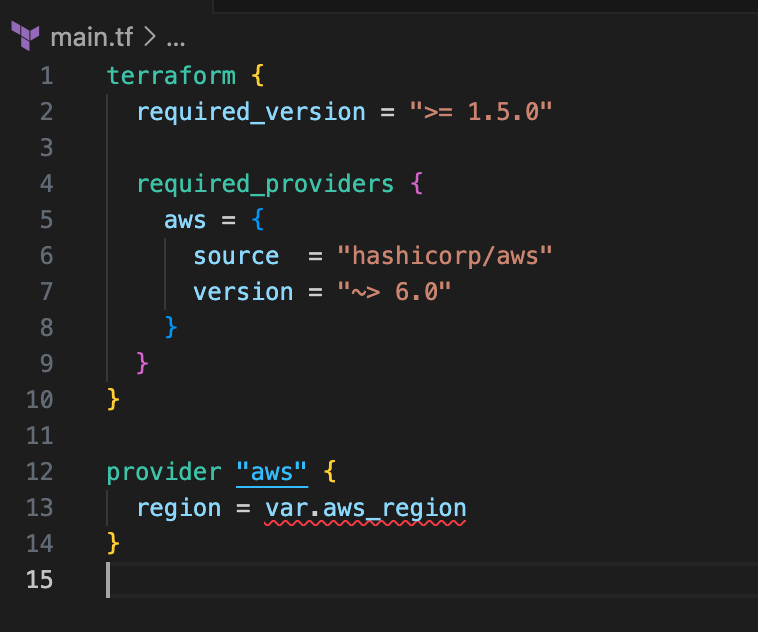

```
required_version = ">= 1.5.0"
```
#### This line will ensure that only versions of Terraform that are 1.5.0 or higher are allowed

```
required_providers {
    aws = {
      source  = "Hashicorp/aws"
      version = "~> 6.0"
    }
  }
```

#### Adding this line will allow me to use the AWS provider plugin to communicate with AWS. The version constraint will allow any version of between 6.0 and 6.99 . 

## - Variables - 
#### Separating variables in terraform is good practice as it allows the code to be easier to: reuse, manage and maintain. Declaring all the variables in one file will help with code organisation which will also make the code easier to re-use as to change parts of the infrastructure such as an EC2 instance size or a AWS region can easily be modified in a variable file instead of skimming through a main.tf file to change them. Within my variables.tf file I have created variables for: aws region, VPC cidr block, two public subnets, instance type and the key name.

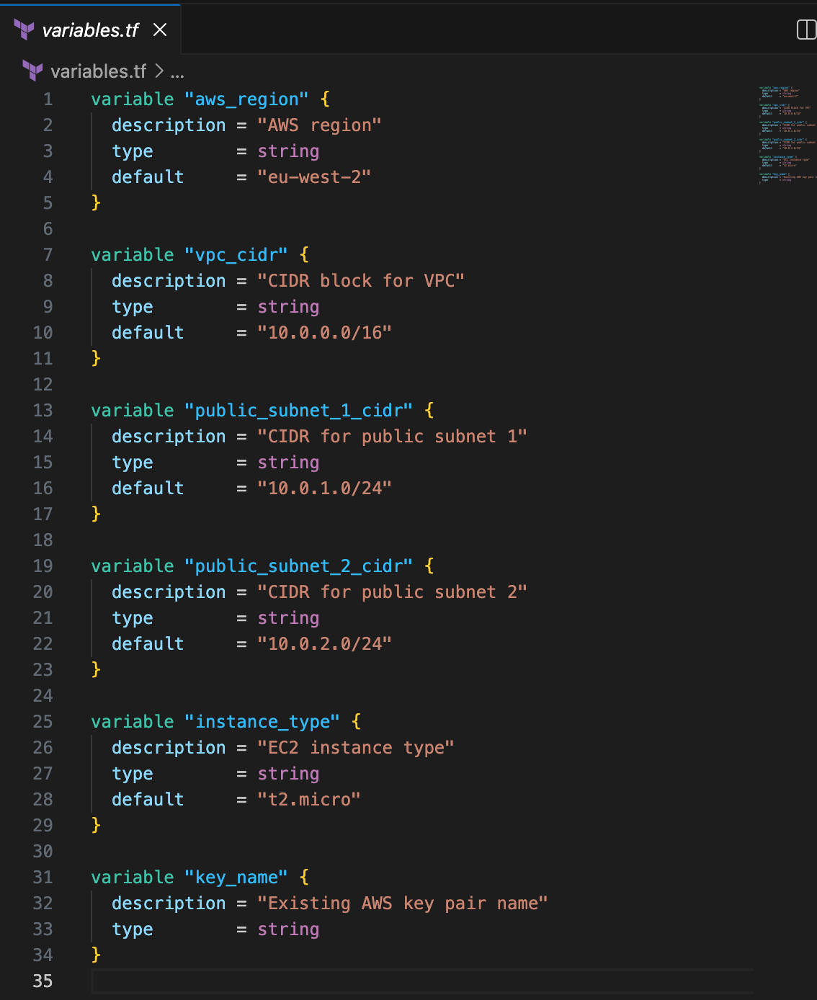 

## - Creating a VPC -
#### In my main.tf file I will create a VPC, Hashicorp provide templates for AWS elements, this is useful as you can paste these into your Terraform projects and edit them to fit your needs. To create my VPC I have added the following to my main.tf file.
```
resource "aws_vpc" "main" {
  cidr_block           = var.vpc_cidr
  enable_dns_support   = true
  enable_dns_hostnames = true

  tags = {
    Name = "terraform-project-vpc"
  }
}
```

## - Creating Subnets -
#### Since I have now created a VPC with Terraform I now want to create two subnets, the reason for me creating my own subnets instead of using AWS default ones is that they can be messy and inconsistent. By creating my own manual ones I can define IP ranges, organise where resources will go as well as which zones are public and private. For example I would put an EC2 instance with internet into a public subnet whereas a database with no internet would go into a private subnet.

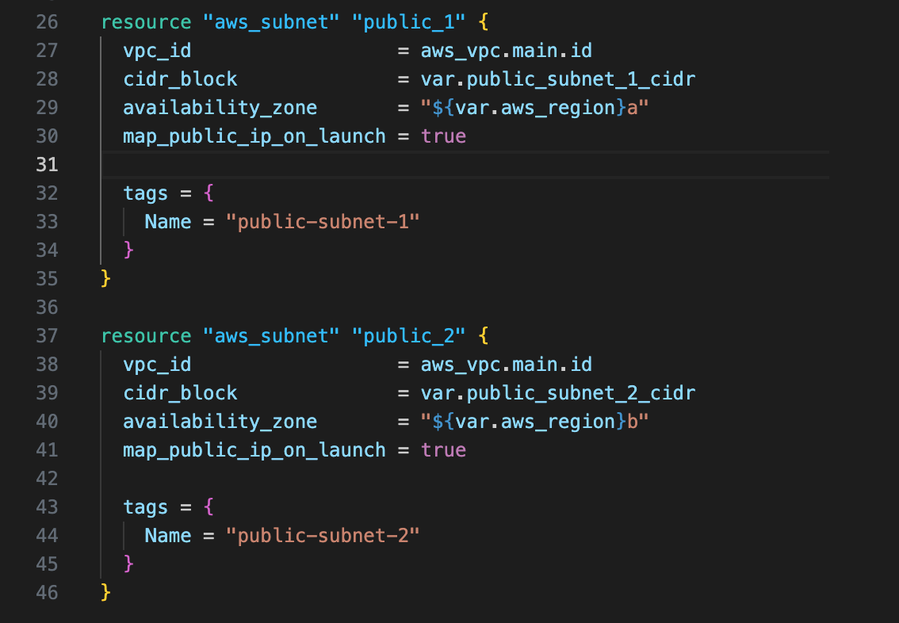 

#### With my subnets I have created them in a separate data centre so that if one of them goes down the other will still be up and running, this follows the concept of availability

## - Adding an Internet Gateway and Route Table -
#### So far I have created a VPC and some subnets, currently my network is completely isolated. To visualise this issue it is as though I have built a house but there is no road connecting it to the outside world, I fix this issue by adding in the Internet Gateway (IGW) and the route table.

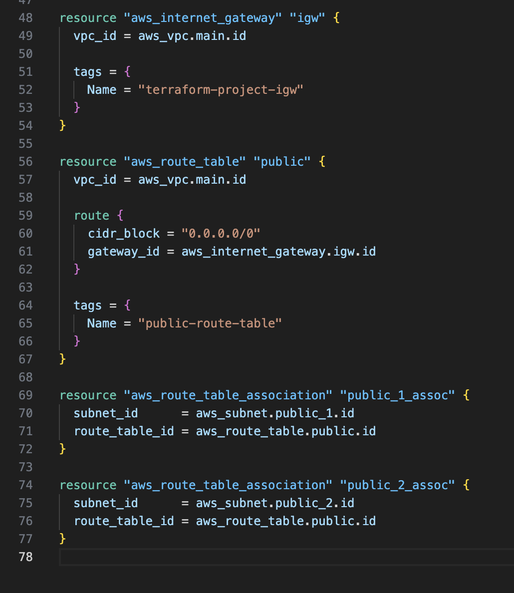

#### With the way my route table is setup anything that leaves the network will be sent to the internet. I have also added a route table association for each one of my subnets. With my Terraform the IGW connects the VPC to the internet, the route table provides the traffic rules and the associations applies the rules to the subnet. 


## - Creating the Security Group - 
#### A security group in AWS is a virtual firewall it allows a user to set who can access an instance as well as what traffic is allowed, in this occasion I will allow SSH and HTTP. 

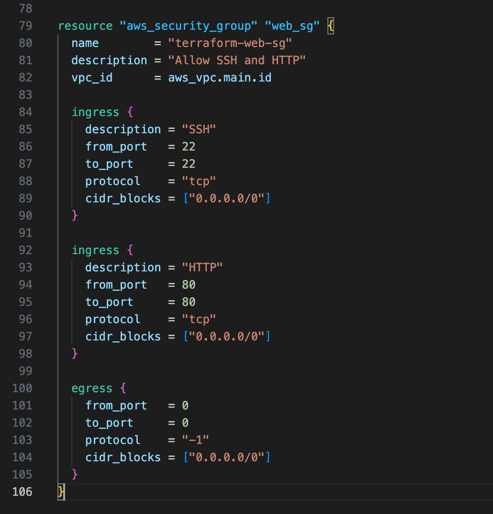

#### With the ingress rules I have set up it port 22 and port 80 are open, this will allow anyone to SSH into the instance or access it via a web browser. Port 80 is open for demonstration purposes. In production, HTTPS (443) would be used with TLS certificates.

## - Adding an EC2 instance - 
#### Within AWS an EC2 instance is a virtual server, this could be used to run a website, host an app or install software. My Terraform code for my EC2 instance is below.

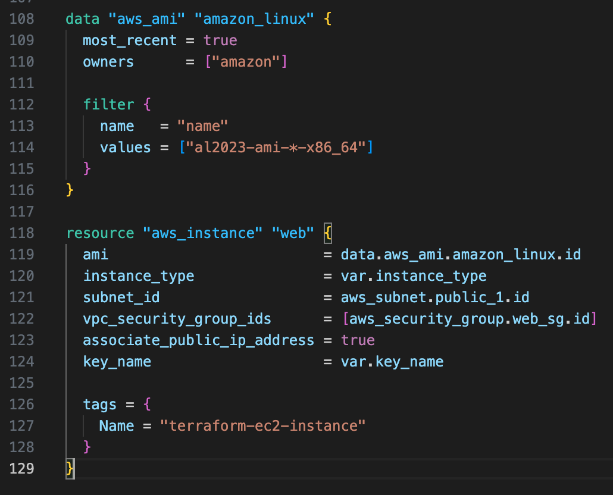

#### In this code block I have used the "data" variable type to call the most recent version of Amazon Linux published by amazon. I have also decided to place the EC2 instance in public subnet 1 and have also attached the security group I just created to it.

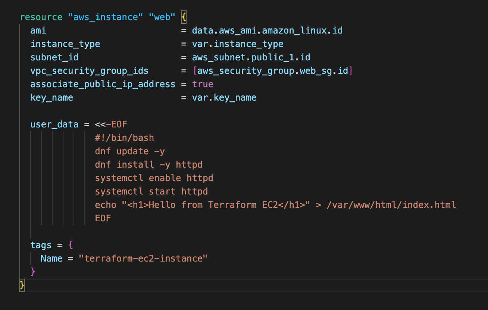

#### I also decided to automatically install a web server when my EC2 is launched, I did this by adding user_data to my code so that a script runs when the instance first boots. The server will automatically update packages and install packages, start a web server and will create a sample homepage. 

## - Creating Outputs -
#### Adding outputs to Terraform is useful as they can show important results after everything is created, I have added the following code to my outputs.tf file

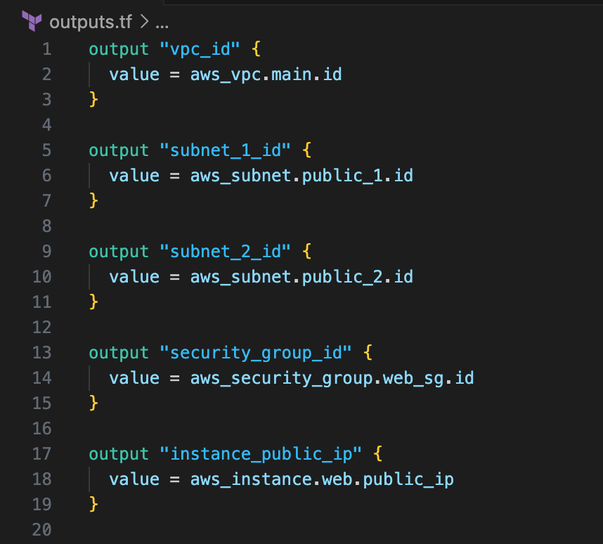

#### With the following code I will see the IDs printed out for the: VPC, both subnets, security group and EC2 instance.

## - Adding Variable Values -
#### The reason for using a tfvars file in Terraform is so that values can be assigned for a specific run as the values set in tfvars will override those set in variables.tf. The purpose of the variables.tf file is to define input whereas the tfvars file will provide the values, in my tfvars file I have the following code which will set the region to "us-east-1" and will use the "TerraformIaC" key pair that I have created just for this project. 

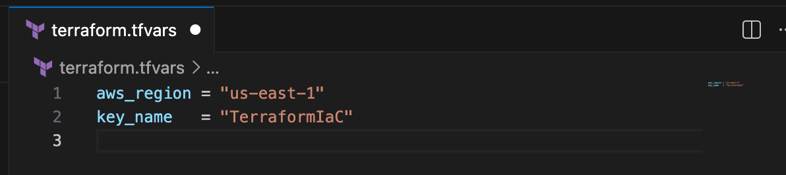

## - Git Ignore - 
#### Adding a Git ignore file is important to add to a Terraform project for the following reasons: Security, keeping the repository clean, and to avoid the exposure of infrastructure state or secrets. 

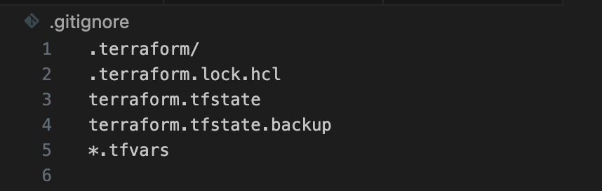

#### The .terraform file will store downloaded provider plugins, module cache and local Terraform working data, I do not want this in a Github repository as it adds unnecessary bloat wear that is not needed. Ignoring the Terraform.tfstate is one of the most important as this can be used to identify which resources exist, their IDs and their current attributes. The .tfvars file is ignored as this frequently contains secrets, amount-specific values and environment-specific values. In more advanced projects this file can contain database passwords, API keys, bucket names and account IDs. For my project I have decided to ignore my tfvars file but I will be uploading a tfvars.example file to my repository so that if someone is to re-use my IaC they will have some examples they can use. This file will contain:

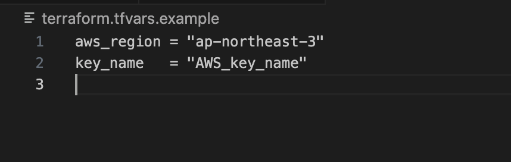

#### If someone was to use my code and use the variables in the tfvars.example file then they would be launching their infrastructure in Osaka.

## - Applying the Terraform - 
#### Now that I have created my IaC using Terraform I will now run my workflow to test that it has been created correctly, to do this I will run the following commands in this order:
```
terraform init
terraform fmt
terraform validate
terraform plan
terraform apply
```

#### Terraform "init" will initialise the project directory, it will download the AWS provider, initialise the backend and provider plugins, without this step the Terraform will not run.
#### Terraform "fmt" is used to reformat the code I have written, this fixes indentation, spacing and alignment. 
#### Terraform "validate" is ran to ensure that the syntax in my configuration is valid, it will catch errors such as missing brackets, wrong argument names and invalid resource references. As can be seen below, all of these commands were ran successfully.

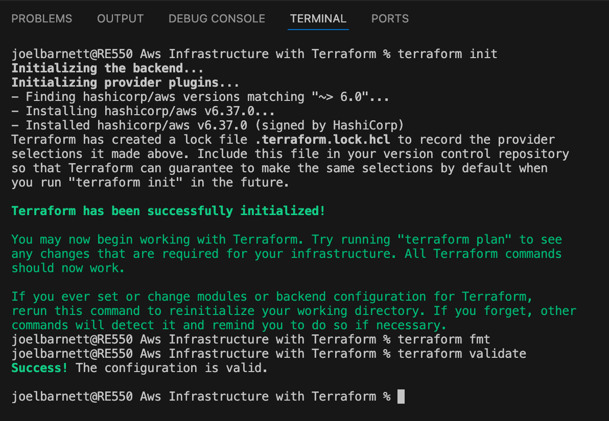

#### Running Terraform "plan" will preview what will happen if you commit the code, terraform will compare your code to the current state and what already exists in AWS. This is an important step as it can catch any mistakes that could occur such as deploying the infrastructure in the wrong region or launching the wrong instance size which could lead to additional unforeseen costs.

#### Finally I will run the Terraform "apply" command to launch my infrastructure, I can see that this has been successful and that the required outputs have been printed to the terminal

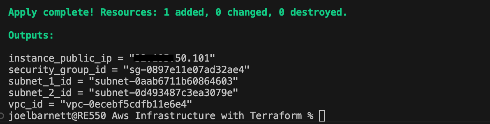

## - Validating the Terraform - 
#### Now that my infrastructure has been deployed I will run the following tests to ensure it has done what was intended
#### First I will check the AWS console to see that my VPC, subnets, internet gateway, route table, security group and EC2 have all been launched correctly.

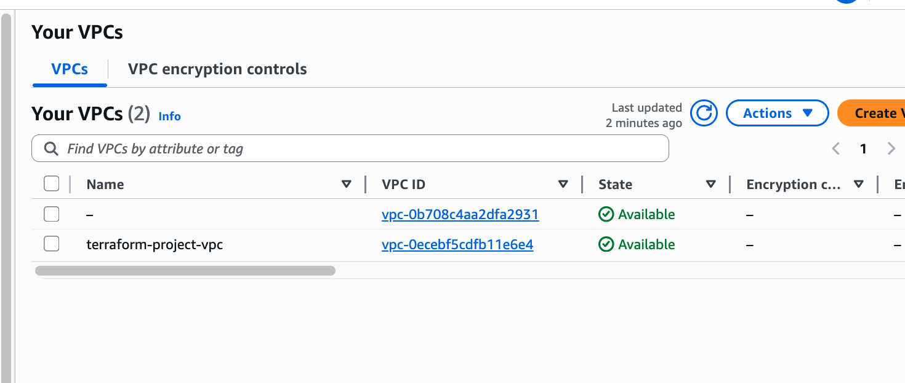
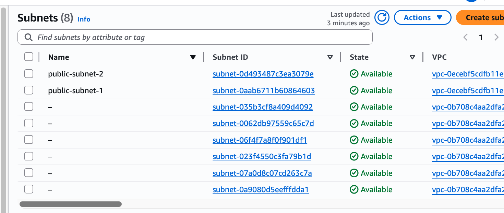
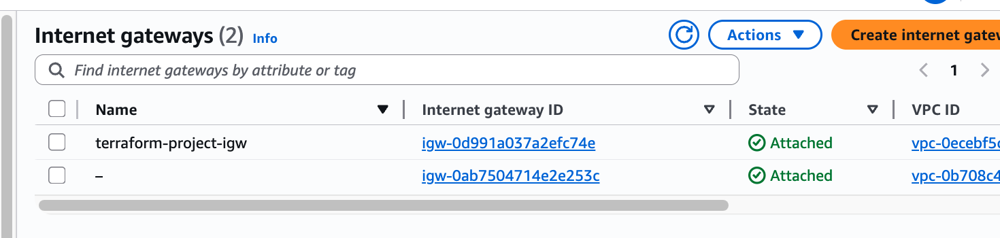
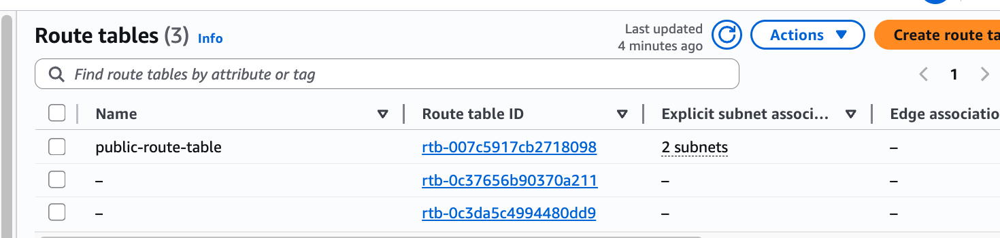
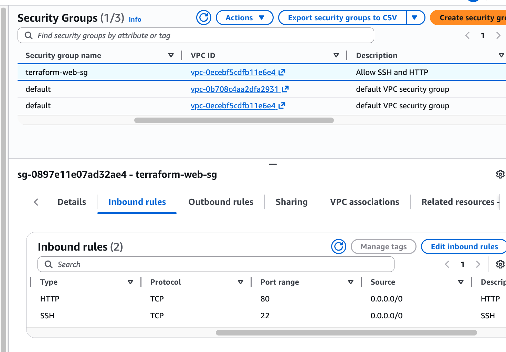
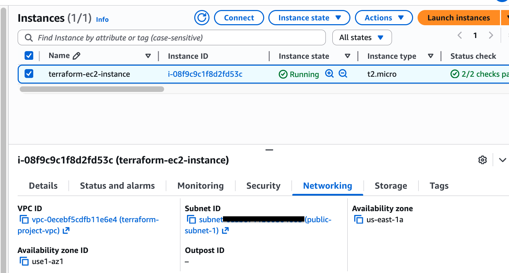

#### Now that I can see that the resources have been launched, I want to check to see if I can access my EC2 via SSH and via a web browser. First of all I will try the SSH route, I will run the following command to the public IP

```
terraform output instance_public_ip
```
#### Next I will ensure my .pem has safe permission so I will run the following command

```
chmod 400 ~/Downloads/TerraformIaC.pem
```

#### Next I will run the following command to SSH into my EC2 instance, I will replace public_ip with the actual EC2 instance's public IP

```
ssh -i ~/Downloads/TerraformIaC.pem ec2-user@public_ip
```

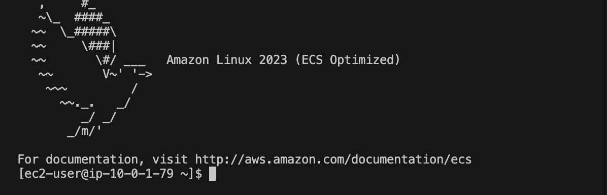

#### Now that I know the SSH route has worked, I will try visiting the EC2 instance via a web browser and confirm that the user_data script has been ran correctly, in my web browser I will enter the following.
```
http://<EC2-public-ip>
```
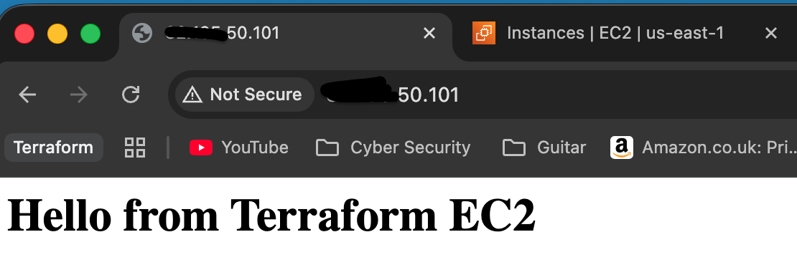

#### Now that I have completed my tests I will run the following command to delete my infrastructure as it is no longer needed.
```
terraform destroy
```


